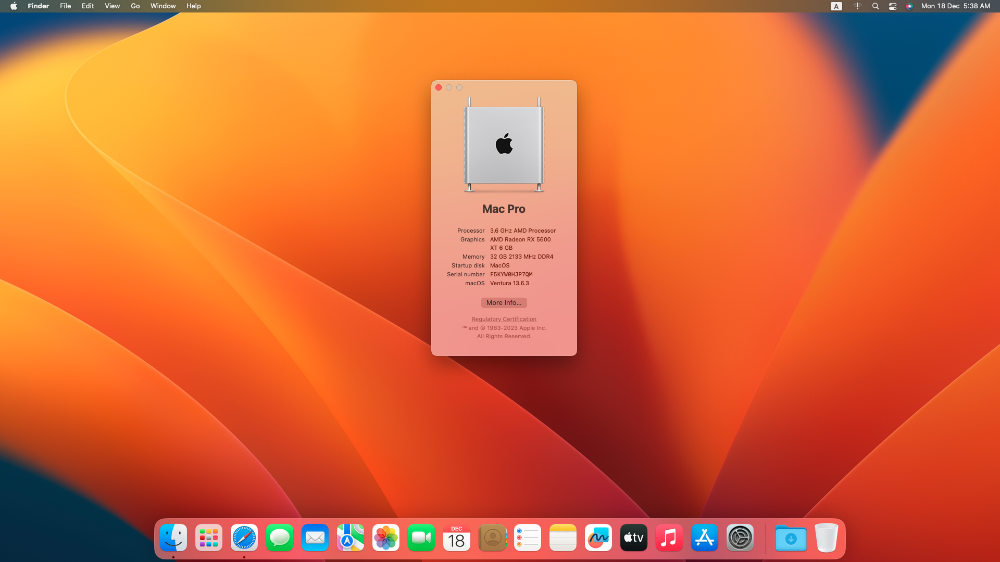

# AMD Ryzen Hackintosh ( Ryzentosh )
A Hackintosh is a computer that runs Apple's Macintosh operating system macOS on Intel computer hardware that is not authorized for the purpose by Apple & Ryzentosh is a hackintosh computer build using AMD Ryzen Processors. In this AMD Ryzen hackintosh build i use OpenCore to multiboot Windows(11) and MacOS(Ventura) Olarila Vanila Images.

## Disclaimer
Please Use My Ryzentosh EFI at your own risk. I take no responsiblity if your rig explodes. Create unique SMBios values for your rig. Don't use ones shown in the my efi config.plist!!!

## Specification

| Component        | Model                                              |
| ---------------- | ---------------------------------------------------|
| CPU              | AMD Ryzen 7 3700x                                   |
| MotherBoard      | MSI B450 Mortar MAX                          |
| OS Disk          | Samsung Nano evo plus 250 GB NVME SSD              |
| RAM              | 4x 8gb Corsair Vengeance Pro 32GB Ram              |
| GPU              | AMD Radeon RX5600XT 6GB                               |
| PS   	   | Antec VP550P          		            |

## Installation Steps

* Download EFI Folder + macOS Ventura Olarila Image + Etcher + Free Parition Wizard Tool + Explorer-Plus-Plus.
* Burn macOS raw Image To USB Drive (32GB) with Etcher
* Mount USB Driver EFI Folder Using Free Parition Wizard Tool
* Replace EFI Folder with My EFI into EFI partition.
* Restart PC & Boot From UEFI USB Drive (USE USB 2.0 PORT)
* Using Disk Utility Erase The Disk (APFS)
* Close Disk Utility & Install macOS Ventura.
* After Install Mount Disk EFI & USB Driver EFI with MountEFI and Replace the Disk EFI Folder with The USB Drive EFI Folder. (Do Not Miss This Step Other Wise Your Hackintosh Will Not Boot Without USB Drive)

## Credits and links

* [OpenCore install guide](https://dortania.github.io/OpenCore-Install-Guide)
* [Oralira Vanilla Hackintosh](https://olarila.com)

